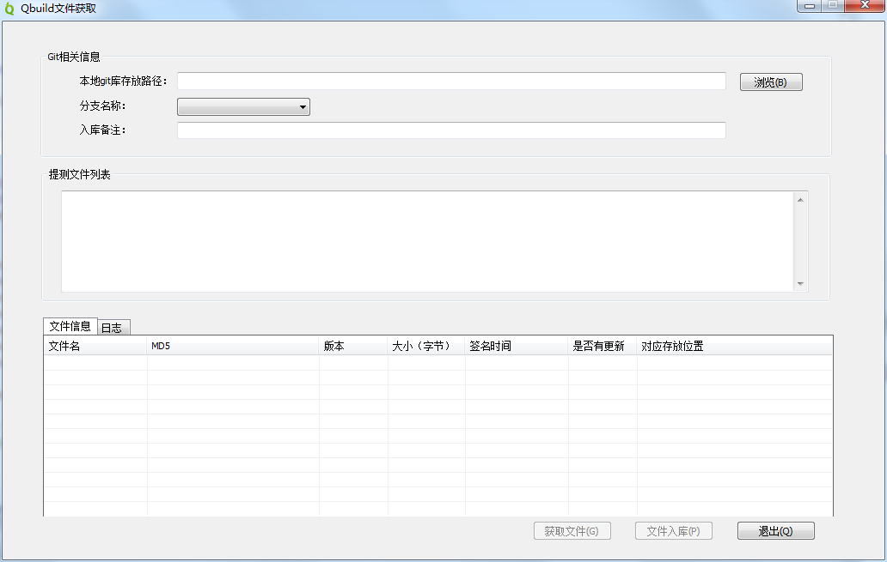
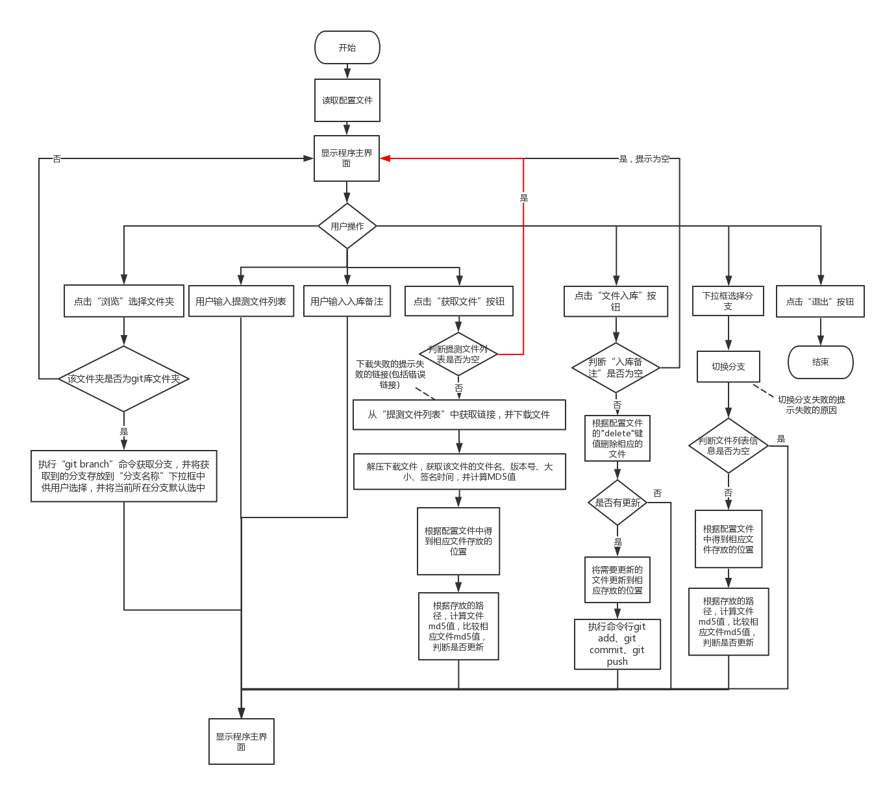
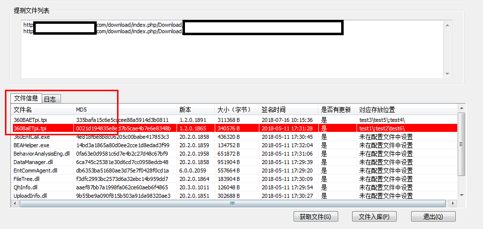

# Git入库工具

## 一、实现目的
- 简化QA入库的操作，即下载链接、解压文件、更新相应位置的文件、入库（包括要切换分支来入库）


## 二、功能简介

- 点击`浏览`，选择`git仓库`，非git仓库会提示不是`git仓库`；选择的是正确的`仓库`，会载入该`git仓库`的分支，并默认选择为当前`git仓库`指定的分支
- 点击`获取文件`时，可以下载`提测文件列表`中url指定的资源，（资源都是zip压缩包）并解压下载下来的压缩包，计算压缩包中每个文件的`MD5值`、获取`版本号`、获取`文件大小`、`签名时间`等等
- 将上述的`文件信息`显示到`文件信息`列表中
- 点击`文件入库`，会根据设定的`git库信息`，通过运行`git命令`，正确的将文件`commit`到`git库`。入库时会根据当前的分支、配置文件指定的文件入库的位置。最终会`push`到`git服务器`端。



## 三、使用流程

### 1. 设置配置文件
首先需要在程序的根目录创建conf文件夹，并放入QbuildAutoToolConfig.json文件

- Json文件包含**两个键值**
    - `Repository`键： 表示**文件在仓库的位置**或要**新增的位置**。可以**包含零个或多个分支键**，但必须要有一个**Default键**。
        - **Default键**：如果在**Default键**中加入文件的**相对路径**，则在当前下拉框选中的分支下，相应文件都会被更新；
        - **分支键**：如果在**分支键**下加入文件的相对路径，则只有该分支下相应文件会被更新；对于**分支键**中找不到的文件的配置，会去**Default键**中查找。

    - `DeleteFile`键： 表示要删除的文件。可以**包含零个或多个分支键**，但必须要有一个**Default键**。
        - **Default键**：如果在**Default键**中加入要删除的文件的相对路径，则在当前下拉框选中的分支下，相应文件会被删除；
        - **分支键**：如果在分支键下加入要删除的文件的相对路径，则只删除该分支下的文件


**注意json格式中，最后一个元素后面不要加 英文逗号 ,** 

**配置文件**内容如下：
```json
{
    "DeleteFile":
    {
        "Default":
        {
            "File1": ["/path1/"],
            "File2": ["/path2/"],
            "File3": ["/path3/"]
        },
        "Branch1":
        {
            "File1": ["/path1/"],
            "File2": ["/path2/"],
            "File3": ["/path3/"]
        },
    },
 
    "Repository":
    {
        "Default":
        {
            "File1": ["/path1/"],
            "File2": ["/path2/"],
            "File3": ["/path3/"]
        },
        "Branch1":
        {
            "File1": ["/path1/"],
            "File2": ["/path2/"],
            "File3": ["/path3/"]
        }
    }
}
```

### 2. 选择Git仓库
- 可以通过`浏览`来选择Git仓库
- 也可以通过`输入`Git仓库路径来设置Git仓库路径
- 非Git仓库或者错误路径会进行弹窗提醒

### 3. 选择分支
- 通过下拉框来选择要入库的**分支**

### 4. 输入提测文件列表的url
- 在`提测文件列表`中键入提测文件列表的url(url指定的资源都是zip压缩包)，以**回车换行符**作为**分隔符**

### 5. 点击`获取文件`按钮
- 程序会先下载`提测文件列表`的url, 将下载下来的压缩包缓存到程序根目录的`Temp`路径下，并会将下载成功失败的情况加入到`日志`中
- 然后程序解压`Temp`下的压缩包，得到相应的文件
- 并计算所得文件的`MD5值`、获取`版本号`、获取`文件大小`、`签名时间`，以及根据1.中的配置文件去判断文件**是否需要更新**
- 并将上述的所有文件信息显示在`文件信息`框中

### 6. 点击`文件入库`按钮
- 程序会将下载下来的文件，根据`配置文件`指定的位置，进行相应文件的更新
- 文件更新后，程序会执行 `git add`、`git commit`(要输入**入库备注**先)、`git push`命令，将文件进行入库

## 四、程序的流程图


## 五、注意事项
- 文件信息出现红色标注的时候， 表明提测文件列表url下载下来有重名的文件（文件名不区分大小写），此时不能入库，会**弹窗提示**


- 其余的错误信息， 也会弹窗提示，不一一赘述


## 六、程序支持的快捷键

- `Ctrl + B` : 打开浏览
- `Ctrl + G` : 获取文件
- `Ctrl + P` : 文件入库
- `Ctrl + Q` : 退出程序